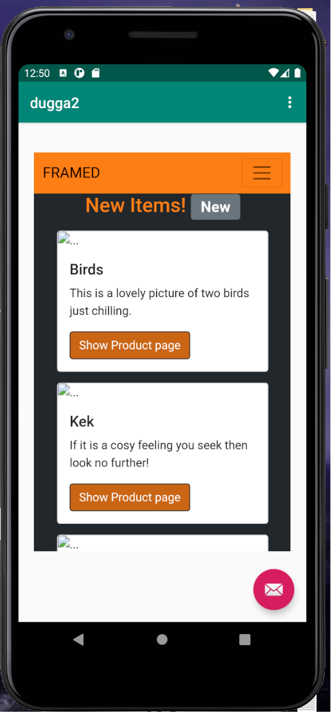

# Rapport

Först ändrades namnet på appen genom att ändra stringen som finns i "strings.xml" som har namnet "app_name".
Därefter lades det till kod som gör att appen får internet tillgång. Koden ser ut som nedan.

```
    <manifest xmlns:android="http://schemas.android.com/apk/res/android"
    package="com.example.webviewapp">
    <uses-permission android:name="android.permission.INTERNET" />

```

Denna koden ligger i "AndroidManifest.xml".
Sedan ersattes den textview som fanns tidigare på appens framsida med en WebView istället.
Detta gjordes i layout filen som heter "content_main.xml". koden som lades till är följande:

```
<WebView
        android:id="@+id/my_webview"
        android:layout_width="350dp"
        android:layout_height="543dp"
        app:layout_constraintBottom_toBottomOf="parent"
        app:layout_constraintEnd_toEndOf="parent"
        app:layout_constraintStart_toStartOf="parent"
        app:layout_constraintTop_toTopOf="parent" />

```

En del av denna kod är där för att göra så att WebView fönstret inte tar upp hela skärmen och följer vissa regler
om var på skärmen den skall vara.

Det har även skapats en private member variable som tilldelas värde från den webview som tidigare gjort i xml filen.
Javascript blir sedan aktiverat genom att regler importeras med två rader kod. dessa kräver
import av annan kod. Se kod nedan.

```
        myWebView = findViewById(R.id.my_webview);
        WebSettings webSettings = myWebView.getSettings();
        webSettings.setJavaScriptEnabled(true);
```

Det har skapats en asset fil som heter test.html som är plaserad under /assets/webPages
som har en exempel sida skapad.

Sedan har metoderna showExternalWebPage() och showInternalWebPage() implementerats. Det som gjort är att de har fått två rader kod
som säger att de skall visa upp en viss sida. Sedan kallar appen på dessa metoder beroende på vad
användaren klickar på. Koden för detta visas nedan.

```
    public void showExternalWebPage(){
        // TODO: Add your code for showing external web page here
        myWebView.loadUrl("https://www.his.se");
    }

    public void showInternalWebPage(){
        // TODO: Add your code for showing internal web page here
        myWebView.loadUrl("file:///android_asset/webPages/test.html");
    }
```

Den ena refererar till en extern sida medans den andra kopplar till sidan som skapades i assets.
Till sist lades dessa två metoder in i de ifsatser som finns för att kunna användas.

Bilden nedan visar hur det ser ut när appen är igång.




